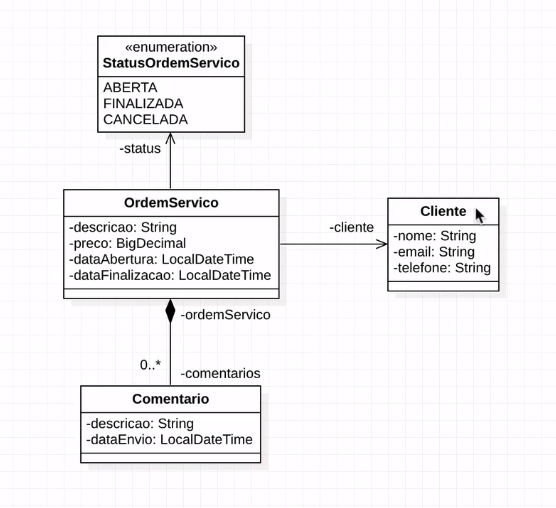

# Curso-de-Spring-REST
Curso Gratuito de Spring REST para Iniciantes

## Aplicação Web a desenvolver
Projeto web services com Spring Boot e MongoDB

### Ambiente Tecnologico
Spring Tool Suite 4, Java, Maven, JPA/Hibernate Apache Tomcat, Postman, MySQL

#### Aula 01
Implementando uma REST API com Spring

### Diagrama de Classes
